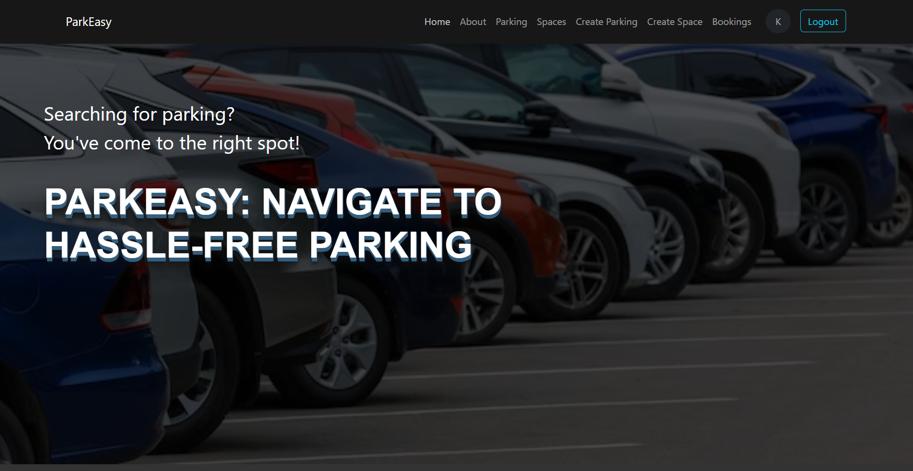
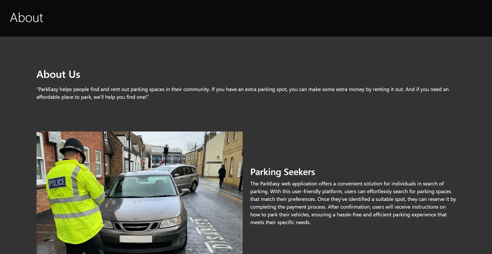
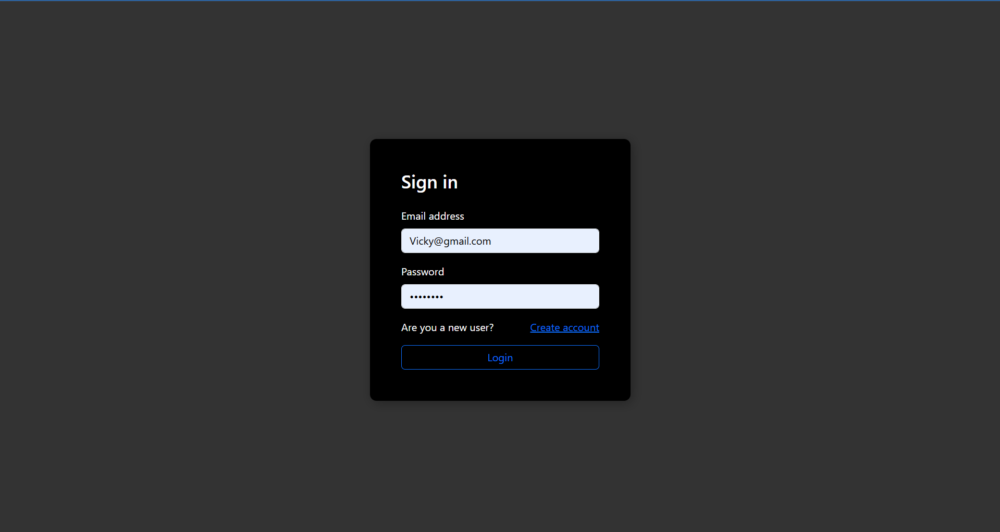
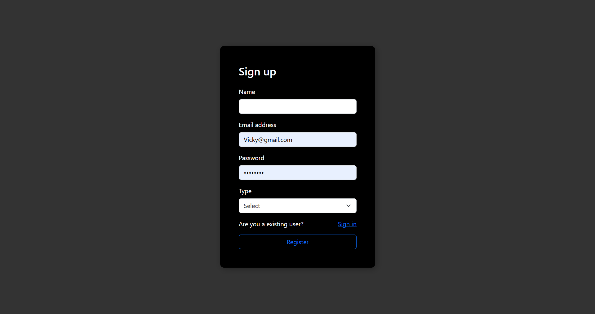

<p align="center">
  
  
  
  
</p>

<p align="center">
  <h1 align="center">🅿️ ParkEasy Client</h1>
  <p align="center">
    <strong>Smart Parking Management System – Frontend</strong>
    <br />
    A modern, responsive solution for effortless parking management.
  </p>
</p>

<p align="center">
  <a href="https://park-easy-client.onrender.com"><strong>Explore the Live Demo »</strong></a>
</p>

---

## 📋 Table of Contents
- [📌 Overview](#-overview)
- [✨ Key Features](#-key-features)
- [🛠 Tech Stack](#-tech-stack)
- [📸 Application Screenshots](#-application-screenshots)
- [⚙️ Setup Instructions](#-setup-instructions)
- [📂 Project Structure](#-project-structure)
- [👨‍💻 Author](#-author)
- [📜 License](#-license)

---

## 📌 Overview

**ParkEasy** is a comprehensive smart parking platform designed to bridge the gap between parking space owners and seekers. Built with the MERN stack, it offers a seamless experience for finding, booking, and managing parking slots in real-time.

---

## ✨ Key Features

### 🔍 For Parking Seekers
- **Smart Search**: Find parking slots by country, city, or specific address.
- **Real-time Availability**: View available spaces for specific dates and times.
- **Easy Booking**: Secure your spot with a simple booking process.
- **Booking History**: Keep track of all your past and upcoming reservations.
- **Reviews & Ratings**: Share your experience and browse others' feedback.

### 🏢 For Parking Owners
- **Property Management**: List your parking locations with ease.
- **Space Control**: Add, update, or remove specific parking slots/spaces.
- **Booking Approval**: Manage incoming booking requests (Approve/Reject).
- **Owner Dashboard**: Overlook all your listed properties and their performance.

---

## 🛠 Tech Stack

- **Frontend**: 
- **State Management**: 
- **Styling**:  + SCSS
- **Networking**: 
- **Authentication**: JWT (JSON Web Tokens)
- **Deployment**: Render

---

## 📸 Application Screenshots

### 🏠 Home & About
````carousel

<!-- slide -->

<!-- slide -->

<!-- slide -->

<!-- slide -->

````

---

### 🔐 Authentication
<p align="center">
  
  
</p>

---

### 🅿️ Parking Management (Owner)
<p align="center">
  
  
</p>

---

### 📍 Space Management (Owner)
<p align="center">
  
  
</p>

---

### 🏙 City & Address Search
````carousel

<!-- slide -->

<!-- slide -->

<!-- slide -->

````

---

### 🔎 Search & Booking (Seeker)
````carousel

<!-- slide -->

<!-- slide -->

````

---

### 📖 Booking Management
````carousel

<!-- slide -->

````

---

### ⭐ Reviews
<p align="center">
  
  
</p>

---

### 👤 Manage Profile
````carousel

<!-- slide -->

````

---

## ⚙️ Setup Instructions

### Prerequisites
- Node.js (v18 or higher)
- npm or yarn

### Installation
1. Clone the repository:
   ```bash
   git clone https://github.com/Kaushik515/park-easy-client
   ```
2. Navigate to the project directory:
   ```bash
   cd park-easy-client
   ```
3. Install dependencies:
   ```bash
   npm install
   ```

### 🔐 Environment Variables
Create a `.env` file in the root directory and add:
```env
REACT_APP_API_URL=your_backend_url
```

### Running Locally
```bash
npm start
```

---

## 📂 Project Structure

```text
src/
 ├── api/           # API interaction layer
 ├── components/    # Reusable UI components
 ├── css/           # SCSS and global styles
 ├── pages/         # Page-level components
 ├── store/         # Redux store and slices
 ├── App.js         # Main application entry
 └── index.js       # React root entry
```

---

## 👨‍💻 Author

**Kaushik Kotha**

---

## 📜 License

Distributed under the MIT License. See `LICENSE` for more information.
